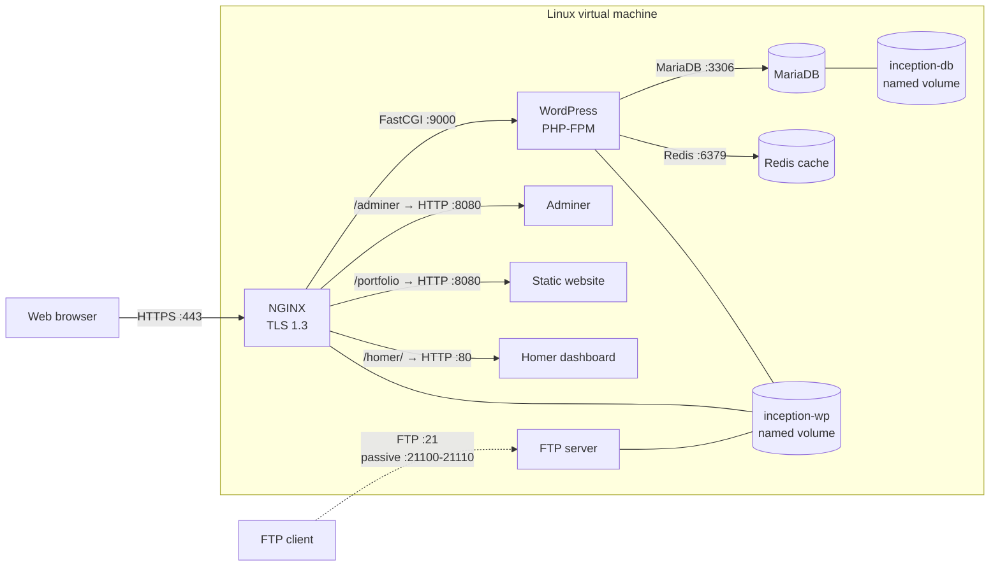
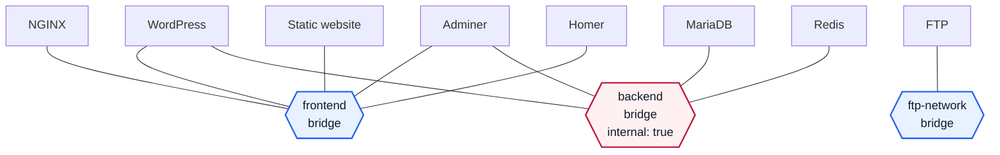

*This project has been created as part of the 42 curriculum by ttanaka.*

# Inception

## Description

Inception is a system-administration project that builds a small web infrastructure with Docker Compose inside a virtual machine. Its goal is to practise service isolation, image creation, networking, secrets management, TLS termination, and persistent storage.

Every service is built from its own `Dockerfile` based on Debian 12 and runs in a dedicated container. Docker Compose creates the containers, three purpose-specific bridge networks, secrets, and two named volumes. NGINX is the HTTPS entry point for the web stack, WordPress is served by PHP-FPM, and MariaDB stores the site database.

The stack contains:

- **NGINX**: accepts HTTPS connections on port 443 using TLS 1.3 and forwards PHP requests to WordPress.
- **WordPress + PHP-FPM**: installs and configures the site and its two users on first launch.
- **MariaDB**: initializes the WordPress database and database user on first launch.
- **Redis**: provides the WordPress object cache.
- **FTP**: provides access to the WordPress `wp-content` directory.
- **Adminer**: provides a browser-based MariaDB administration interface.
- **Static website**: serves a simple portfolio without PHP.
- **Homer**: provides a dashboard linking to the services.

### Request flow

This diagram shows application traffic and persistent-storage mounts. A line to a volume is a filesystem mount, not a network connection.

### Docker network membership

This diagram shows which user-defined bridge each container joins. An edge means network membership, not a request. WordPress and Adminer intentionally join both application networks; FTP shares WordPress files through a volume and therefore needs no network path to WordPress.

### Project sources

- `Makefile` provides the supported setup and lifecycle commands.
- `srcs/docker-compose.yml` defines the Linux/VM stack.
- `srcs/docker-compose.mac.yml` is a local macOS convenience variant with separate volume names.
- `srcs/.env.example` lists the required non-secret configuration.
- `srcs/requirements/<service>/Dockerfile` builds each image.
- `srcs/requirements/nginx/conf/` contains the TLS virtual-host and routing configuration.
- `srcs/requirements/wordpress/` and `srcs/requirements/mariadb/` contain first-run initialization scripts.
- `srcs/requirements/bonus/` contains Redis, FTP, Adminer, the static site, and Homer.
- `srcs/requirements/tools/daemon.json.example` shows the required Docker data-root for the Linux VM.

### Main design choices

- Images are built locally from Debian 12 rather than using ready-made application images.
- One foreground process runs as PID 1 in each container; no infinite-loop or `tail -f` workaround is used.
- Three user-defined bridge networks apply least-privilege connectivity while retaining DNS resolution by service name: `frontend` for NGINX and its upstreams, the externally isolated `backend` for data services, and `ftp-network` for FTP.
- NGINX exposes the web stack on port 443 and serves Homer under `/homer/`. FTP separately publishes its control and passive data ports because it uses a non-HTTP protocol.
- Passwords and TLS private material are supplied through ignored Docker secret files. Non-sensitive settings are supplied through an ignored `.env` file.
- WordPress files and MariaDB data use Docker-managed named volumes. On the Linux VM, Docker's data-root is moved under `/home/ttanaka/data/docker` so the named-volume data is stored below the required `/home/ttanaka/data` directory.
- Health checks order the MariaDB, WordPress, and NGINX startup sequence, while `restart: always` restarts services after failures.

### Technology comparisons

#### Virtual machines vs Docker

A virtual machine emulates a complete machine and runs its own guest kernel, which gives strong isolation but costs more memory, storage, and startup time. A Docker container isolates a process while sharing the host kernel, so it is lighter and starts faster. Inception uses both layers: the assignment runs inside a VM for host-level isolation, while Docker separates the individual services inside that VM.

#### Secrets vs environment variables

Environment variables are convenient for ordinary configuration, but they are visible to processes and inspection tools and can leak through logs or diagnostics. Docker secrets are granted per service and mounted as files under `/run/secrets`, reducing accidental exposure. This project keeps domain names, database names, and usernames in `.env`, while passwords, the TLS certificate, and the TLS private key are supplied as Docker secrets. Both local locations are ignored by Git.

#### Docker network vs host network

User-defined Docker bridge networks give each service its own network namespace, restrict the stack's internal traffic, and let containers address one another by service name. Host networking removes that boundary and makes a container share the host network directly, increasing the risk of port collisions and unintended exposure. This project separates web-facing upstreams, data services, and FTP across `frontend`, `backend`, and `ftp-network`, and publishes only the required entry points.

#### Docker volumes vs bind mounts

Named volumes are created and managed by Docker, are independent of a container's lifecycle, and are portable across Compose recreations. Bind mounts directly expose a chosen host path and couple a container to that host's directory layout and permissions. This project uses named volumes for WordPress and MariaDB data as required; the Docker daemon's data-root places their managed storage under `/home/ttanaka/data` on the Linux VM.

## Instructions

The evaluated environment is a Linux virtual machine with Docker Engine, Docker Compose v2, GNU Make, and OpenSSL. From the repository root:

1. Configure the Docker daemon data-root using `srcs/requirements/tools/daemon.json.example`, then restart Docker.
2. Map the VM IP address to `ttanaka.42.fr` in the client machine's hosts file.
3. Copy `srcs/.env.example` to `srcs/.env` and fill every value. The WordPress administrator username must not contain `admin` or `administrator` in any letter case.
4. Create the password files documented in `USER_DOC.md`; do not commit them.
5. Run `make setup` to generate the private certificate authority and server certificate.
6. Run `make` (or `make up`) to build and start the stack.
7. Open `https://ttanaka.42.fr` and accept or trust the locally generated CA certificate.

Use `make status` to check the stack and `make down` to stop it without deleting persistent data. The macOS convenience configuration uses `make up-mac`, `make status-mac`, and `make down-mac`; it does not replace the required VM environment.

For complete operator instructions, credential locations, service URLs, and health checks, see [USER_DOC.md](USER_DOC.md). For environment setup, Compose commands, volume persistence, and development workflows, see [DEV_DOC.md](DEV_DOC.md).

## Resources

- [Docker overview](https://docs.docker.com/get-started/docker-overview/)
- [Docker containers and virtual machines](https://docs.docker.com/get-started/docker-concepts/the-basics/what-is-a-container/)
- [Docker Compose documentation](https://docs.docker.com/compose/)
- [Docker Compose secrets](https://docs.docker.com/compose/how-tos/use-secrets/)
- [Docker volumes](https://docs.docker.com/engine/storage/volumes/)
- [Docker network drivers](https://docs.docker.com/engine/network/drivers/)
- [NGINX HTTPS configuration](https://nginx.org/en/docs/http/configuring_https_servers.html)
- [MariaDB Server documentation](https://mariadb.com/docs/server/)
- [WordPress developer documentation](https://developer.wordpress.org/)
- [WP-CLI command reference](https://developer.wordpress.org/cli/commands/)
- [Redis documentation](https://redis.io/docs/latest/)

### Use of AI

AI was used to help draft and review the documentation and to review the Docker network design. It was given the project subject and the repository's Compose files, Dockerfiles, configuration files, Makefile, and initialization scripts. The resulting network segmentation, Homer reverse-proxy changes, and documentation were checked against those sources and validated with Compose configuration checks, container image builds, NGINX syntax validation, and HTTP requests. AI was not used to generate credentials.
